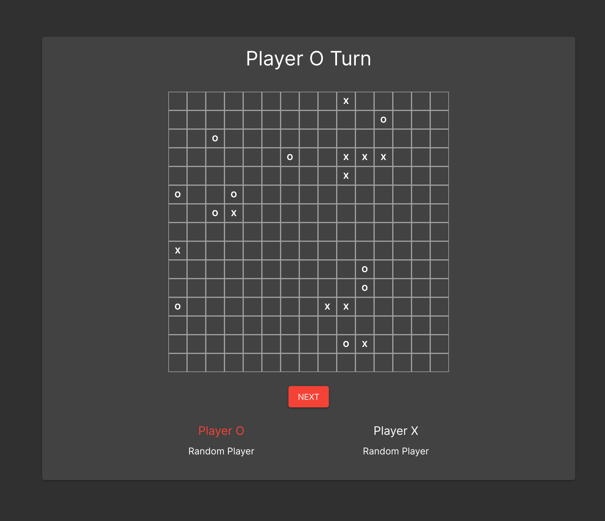

# PO1_Exercise4
A small demo on how to build a multiplayer board game using Spring Boot and React.



## Building and running

The project is a Gradle Spring application. To run it you need to call the `bootRun` gradle task:

```bash
git clone https://github.com/giulioz/PO1_Exercise4.git
cd PO1_Exercise4
./gradlew bootRun
```

This task will take care of the build and run process. To open the application (while it is running) use a browser to navigate to [http://localhost:8080](http://localhost:8080).

### Frontend Dev Mode

The React frontend code is located in `src/main/resources/board-react-app`, and uses [create-react-app](https://create-react-app.dev/). You can use a live-reload dev environment using [Node.js](https://nodejs.org/it/):

```bash
cd src/main/resources/board-react-app
npm -g install yarn
yarn install
yarn start
```
